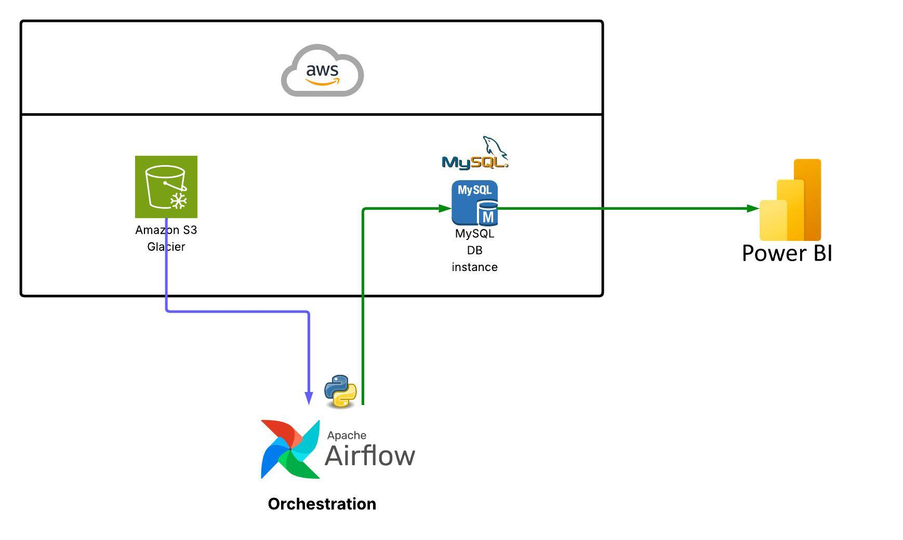
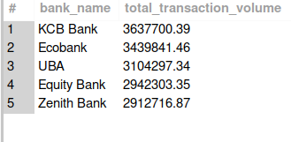
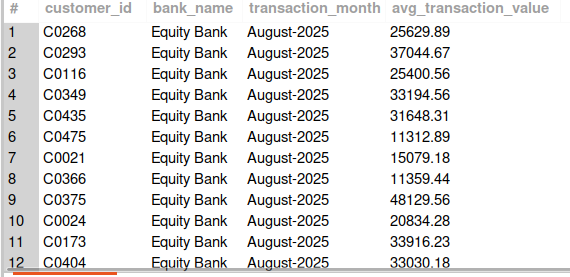
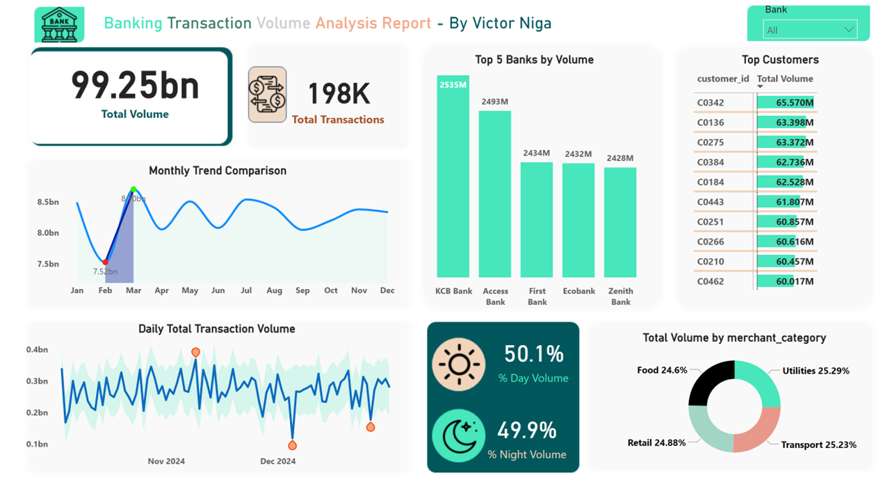

# 🏦 Banking Transaction Pipeline Project

This project demonstrates an end-to-end data pipeline for processing banking transactions using Apache Airflow, AWS S3, Python, MySQL (Amazon RDS), and Power BI. It extracts transaction data from cloud storage, transforms it into meaningful insights, loads it into a database, and visualizes the results in an interactive dashboard.

---

## 🧠 Overview

The pipeline automates the flow of transaction data:
1. **Extracts** raw transaction CSVs from AWS S3
2. **Transforms** the data using Python (cleansing, aggregation, formatting)
3. **Loads** the cleaned data into a MySQL database (Amazon RDS)
4. **Visualizes** the results using Power BI

---

## 🗺️ Architecture Diagram

Below is the architecture of the data pipeline:

📥 **AWS S3** → 🛠️ **Airflow DAG** → 🔄 **Python Transform Script** → 🗄️ **Amazon RDS** → 📊 **Power BI**



---

## 📁 Folder Structure

banking_pipeline_project/
├── dags/
│ └── transactions_pipeline_dag.py
├── scripts/
│ └── transform.py
├── data/
│ └── tmp/
│ ├── transactions.csv
│ └── transformed_transactions.csv
├── sql/
│ ├── monthly_avg_transaction_per_customer.sql
│ └── top_5_banks_last_7_days.sql
├── visualizations/
│ └── transaction_dashboard.pbix
├── images/
│ ├── architecture_diagram.png
│ ├── top_banks_output.png
│ └── monthly_avg_output.png
├── logs/
│ └── transform.log
├── .env
├── requirements.txt
└── README.md

---

## ⚙️ Technologies Used

- **Apache Airflow** – DAG-based orchestration
- **AWS S3** – Raw data storage
- **Python & Pandas** – Data transformation
- **MySQL (RDS)** – Clean data storage
- **Power BI** – Dashboard and reporting
- **python-dotenv** – Manages environment variables

---

## 🚀 Setup Instructions

### 1. Clone the repository

```bash
git clone https://github.com/your-username/banking_pipeline_project.git
cd banking_pipeline_project
```

### 2. Create and activate a virtual environment

```bash
python3 -m venv venv
source venv/bin/activate
```

### 3. Install required Python packages

```bash
pip install -r requirements.txt
```

### 4. Create a `.env` file

```env
# AWS
AWS_ACCESS_KEY="***"
AWS_SECRET_KEY="***"
AWS_REGION="***"
S3_BUCKET="***"
S3_KEY="***"

# MySQL
MYSQL_HOST="***"
MYSQL_PORT="***"
MYSQL_USER="***"
MYSQL_PASSWORD="***"
MYSQL_DB="***"
```

### 5. Start Airflow

```bash
airflow db init
airflow webserver --port 8080
airflow scheduler
```

Visit [http://localhost:8080](http://localhost:8080) and trigger the `transactions_pipeline` DAG.

---

## 📦 Airflow DAG Overview

The DAG performs 3 tasks:
- `download_csv_from_s3`: Downloads raw transaction CSV
- `transform_csv`: Applies cleaning and aggregation logic
- `load_to_mysql`: Inserts transformed data into MySQL

---

## 🔄 ETL Workflow Description

1. **Extract** → AWS S3 → Raw transaction data  
2. **Transform** → Python script → Cleans and aggregates data  
3. **Load** → Amazon RDS (MySQL) → Final cleaned data  
4. **Visualize** → Power BI → Business insights and trends  

---

## 🧾 SQL Queries Included

## 🧾 SQL Queries Included

### 🔹 Top 5 Banks by Transaction Volume (Last 7 Days)

This query returns the top 5 banks based on total transaction volume over the last 7 days.

```sql
SELECT 
    bank_name,
    SUM(amount) AS total_transaction_volume
FROM 
    transactions
WHERE 
    timestamp >= NOW() - INTERVAL 7 DAY
GROUP BY 
    bank_name
ORDER BY 
    total_transaction_volume DESC
LIMIT 5;
```

**File**: `sql/top_5_banks_last_7_days.sql`  
**Screenshot**:  


---

### 🔹 Monthly Average Transaction Value Per Customer

This query calculates the average transaction value per customer for August 2025, with the month spelled out.

```sql
SELECT 
    customer_id,
    bank_name,
    DATE_FORMAT(timestamp, '%M-%Y') AS transaction_month,
    ROUND(AVG(amount), 2) AS avg_transaction_value
FROM 
    transactions
WHERE 
    DATE_FORMAT(timestamp, '%Y-%m') = '2025-08'
GROUP BY 
    customer_id,
    bank_name,
    transaction_month;
```

**File**: `sql/monthly_avg_transaction_per_customer.sql`  
**Screenshot**:  



---

## 📊 Power BI Dashboard

Interactive dashboard showing:
- Daily total transaction volume
- Top 5 banks by volume
- Monthly trend comparison
- Anomalous volume detection

**File**: `visualizations/transaction_dashboard.pbix`
**Link**: https://app.powerbi.com/view?r=eyJrIjoiOGYxNmE5Y2ItMWUyNC00YjNhLTkyNTItYzU2ZTNiNDY4MmE4IiwidCI6ImJjYjlmYWE1LTQyNDctNGU0Ni1iMDgxLWI5YzA0MGU1NzY4NiJ9
  
**Screenshot**:  


---

## 🚧 Future Improvements

- Add support for JSON and Parquet formats  
- Automate Power BI data refresh  
- Add alerting via Slack/Email  
- Replace daily trigger with S3 event-based trigger  

---

## 📄 License

This project is for demonstration purposes only.


